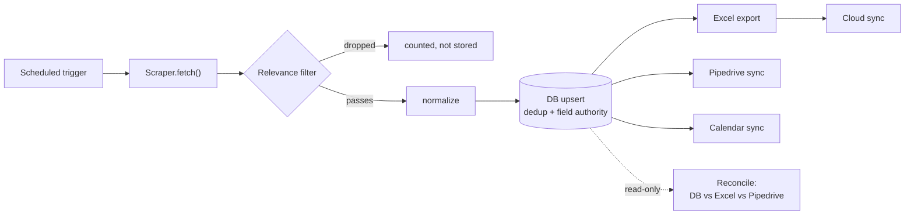
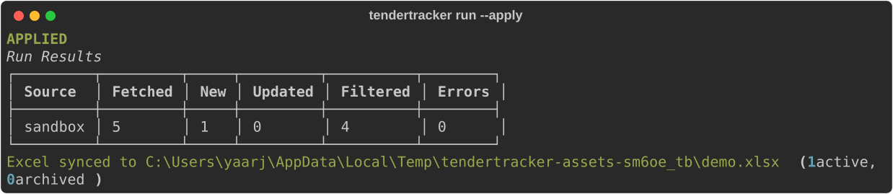
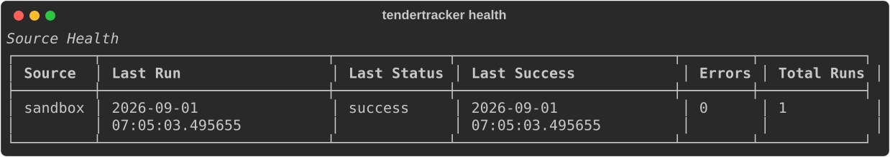
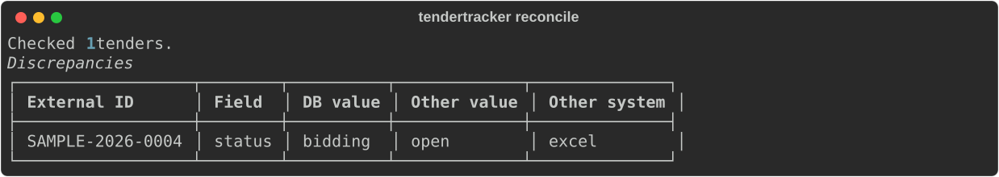

# Tender Tracking System

[](https://github.com/codeapplied/tender-tracking-system/actions/workflows/tests.yml)
[](pyproject.toml)
[](LICENSE)

A tender/bid tracking tool — rebuilt as a generalized, open-source system.

Originally built as an internal work tool; this repo is a from-scratch rebuild using
generic, sanitized logic only. No employer-specific data, workflows, or branding.

## Status

The originally-scoped build is complete: DB models, config loading, CLI,
scraper interface, the daily pipeline (normalize/filter/dedupe/store),
Excel export, optional cloud sync (OneDrive/SharePoint + Outlook calendar),
Pipedrive deal sync, read-only reconciliation checks, per-source
health/error reporting, a scheduled GitHub Actions workflow, and a test
suite (55 tests — see [Testing](#testing) below). See
[closed issues](https://github.com/codeapplied/tender-tracking-system/issues?q=is%3Aissue+is%3Aclosed)
for the full build history and
[docs/ARCHITECTURE.md](docs/ARCHITECTURE.md) for how it fits together.

## Architecture



Every run is logged to `SyncLog`, which the ops CLI reads for pipeline
health (last run per source, error counts). Full breakdown, module
responsibilities, a sequence diagram of one daily run, and the reasoning
behind the key design decisions (dry-run-by-default, field-level authority,
local-snapshot diffing): [docs/ARCHITECTURE.md](docs/ARCHITECTURE.md).

## In action

Real output from the actual CLI (sandbox data, default relevance filter) —
not mockups. Regenerate these with `python scripts/generate_readme_assets.py`
after any CLI change.

**`tendertracker run --apply`** — fetches, filters (4 of 5 sample records
correctly dropped by the default EV/charging relevance filter), stores, and
re-syncs Excel in one command:



**`tendertracker health`** — per-source rollup: last run, last success,
error count:



**`tendertracker reconcile`** — catches a status that was edited directly in
Excel and never made it back to the DB, without writing anything itself:



## Setup

```
uv venv
uv pip install -e .
cp config/.env.example .env
cp config/portals.example.yaml config/portals.yaml
tendertracker init
```

## Troubleshooting

**Windows Application Control policy blocks `tendertracker.exe`**: on some
locked-down Windows machines, the venv's generated launcher `.exe` gets
blocked outright. Run via the module instead, which sidesteps it entirely:
`python -m tendertracker.cli <command>`.

## CLI

- `tendertracker init` — create the database
- `tendertracker status` — recent sync runs, most recent first, flat across
  all sources
- `tendertracker health` — per-source rollup instead: last run, last
  success, error count, total runs — the "is anything actually broken" view
- `tendertracker errors [--limit N]` — recent error messages, most recent
  first
- `tendertracker sources` — list configured portal sources
- Pass `--verbose`/`-v` before any command for debug-level logging.
- `tendertracker run` — run the daily fetch pipeline. **Plan-only by default**
  (fetches, normalizes, filters, computes what would change, logs the run —
  no DB writes). Pass `--apply` to actually write; on `--apply`, also
  re-syncs the Excel tracker from the DB. This default-safe direction was
  a deliberate choice, not an oversight — see the pipeline module for why.
- `tendertracker export` — regenerate the Excel tracker from current DB
  state without running the full pipeline. Two sheets (Active/Archived,
  split by status), formatted headers, a status dropdown per row, DB is
  always the source of truth — re-running fully regenerates the file. Also
  syncs to OneDrive/SharePoint if configured (see below).
- `tendertracker sync-cloud` — upload the current Excel tracker to
  OneDrive/SharePoint via Microsoft Graph. Optional — skip entirely and the
  tracker stays a local file only. Setup: [docs/CLOUD_SYNC_SETUP.md](docs/CLOUD_SYNC_SETUP.md).
- `tendertracker sync-pipedrive` — create/update Pipedrive deals for tracked
  tenders (org find-or-create, deal, a note with source metadata). **Plan-only
  by default**, `--apply` to write for real. Also runs automatically as part
  of `run --apply` if `PIPEDRIVE_API_TOKEN`/`PIPEDRIVE_DOMAIN` are set —
  silently skipped otherwise, same pattern as cloud sync.
- `tendertracker sync-calendar` — project open tenders' closing dates as
  Outlook calendar events (Microsoft Graph). **Plan-only by default**,
  `--apply` to write for real. Diffs against a locally-stored snapshot of
  what was last written rather than re-fetching from the Calendar API — see
  [docs/CLOUD_SYNC_SETUP.md](docs/CLOUD_SYNC_SETUP.md) for why and how to
  configure. Also runs automatically as part of `run --apply` if configured;
  cleans up (deletes) the calendar event when a tender closes.
- `tendertracker reconcile` — read-only diff: DB vs. Excel (the status
  field, the one thing the spreadsheet's dropdown lets a human edit) and DB
  vs. Pipedrive (title, value — in case a deal was independently edited in
  Pipedrive's own UI). Reports discrepancies for a human to resolve; **never
  writes a fix itself** — matches the governance-over-automation approach
  documented for the rest of this project.

## Testing

```
uv pip install -e ".[dev]"
pytest
```

55 tests covering: normalize (date parsing, per-source field mapping),
relevance filtering, the core pipeline (dedup, field-level authority,
per-record error isolation — using a real temp SQLite DB, not mocked), and
every external integration (Pipedrive, OneDrive/SharePoint, Outlook
Calendar) via mocked HTTP request-shape assertions, since no live
credentials for those services are available in CI. Pipedrive and calendar
sync orchestration are each tested against a real DB with the external
client mocked, covering dry-run-vs-apply, idempotency, and the
create-then-update transition. Reconciliation orchestration is tested
separately against a real DB and a real generated Excel file (plus a mocked
Pipedrive client) — read-only behavior is asserted directly (confirms zero
writes), along with correctly distinguishing "verified in sync" from
"nothing was available to compare against."

## Adding a source or a sync target

See [docs/ADDING_A_SCRAPER.md](docs/ADDING_A_SCRAPER.md) and
[docs/ARCHITECTURE.md](docs/ARCHITECTURE.md).

## License

MIT — see [LICENSE](LICENSE).
