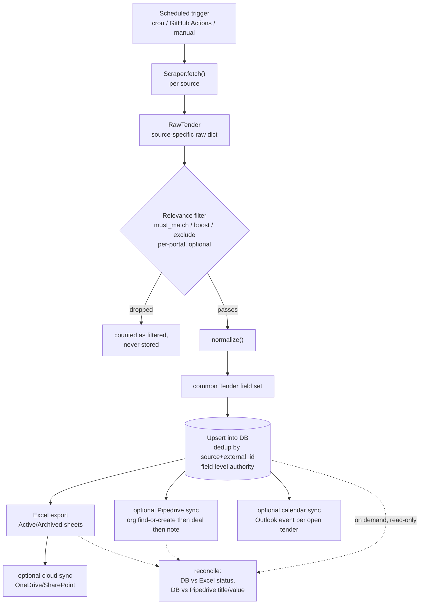
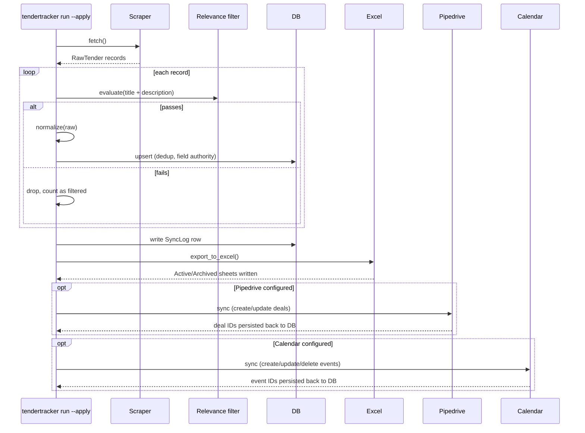
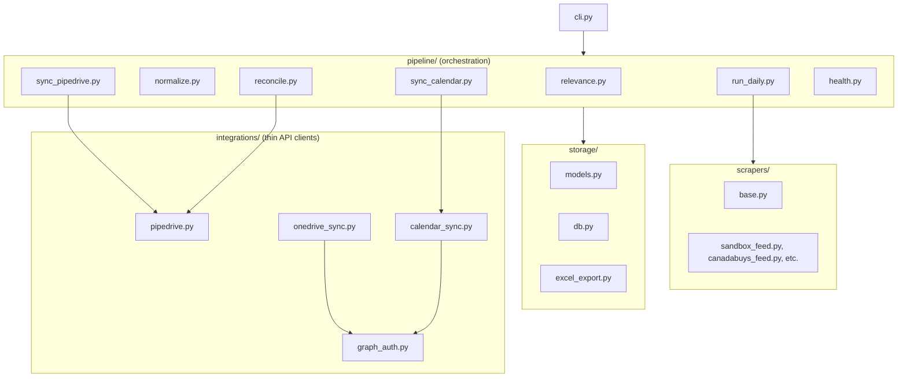

# Architecture

## Data flow

Every pipeline run writes a `SyncLog` row (per source, per run) — what
`tendertracker status`/`health`/`errors` read.

## Sequence: one daily run

## Components

| Module | Responsibility |
|---|---|
| `scrapers/base.py` | `Scraper` interface + `RawTender` shape every source implements |
| `scrapers/*.py` | One implementation per source (sandbox fixture, CanadaBuys feed, a template for private aggregators) |
| `pipeline/relevance.py` | Keyword-based must-match/boost/exclude scoring |
| `pipeline/normalize.py` | Source-specific raw dict → common `Tender` fields |
| `pipeline/run_daily.py` | Orchestrates scrape → filter → normalize → upsert per source |
| `pipeline/sync_pipedrive.py` | Orchestrates DB → Pipedrive deal sync |
| `pipeline/sync_calendar.py` | Orchestrates DB → Outlook calendar event sync |
| `pipeline/reconcile.py` | Read-only cross-system diff |
| `pipeline/health.py` | Per-source health rollup + recent errors, read from `SyncLog` |
| `storage/models.py` | `Tender`, `SyncLog` SQLAlchemy models |
| `storage/db.py` | Engine/session setup (SQLite) |
| `storage/excel_export.py` | DB → formatted `.xlsx` |
| `integrations/pipedrive.py` | Thin Pipedrive REST v1 client |
| `integrations/onedrive_sync.py` | Thin OneDrive/SharePoint (Graph) client |
| `integrations/calendar_sync.py` | Thin Outlook Calendar (Graph) client |
| `integrations/graph_auth.py` | Shared Microsoft Graph app-only OAuth |
| `config.py` | `.env` + `portals.yaml` loading |
| `cli.py` | Typer CLI wiring everything above together |

Integration clients (`integrations/*.py`) contain no DB or business logic —
they're thin API wrappers. Orchestration (what to sync, when, and how to
decide something changed) lives in `pipeline/*.py`. This split is what
makes each piece independently testable with mocks.

## Design decisions

**Plan-only by default, `--apply` to write for real.** Every mutating
command defaults to computing and reporting what *would* happen, without
writing anything — `run`, `sync-pipedrive`, `sync-calendar` all follow this.
`export` and `sync-cloud` always write (regenerating a local file / pushing
it isn't a judgment call the way creating a CRM deal is). `reconcile` never
writes at all, under any flag. This wasn't the original design — it came
from reviewing what actually held up in a prior, related system: dry-run as
an opt-in flag was tried and abandoned in favor of dry-run as the default,
after real incidents where trusting automation by default caused problems.

**Field-level authority, not whole-record authority.** A scraper re-run
should never silently overwrite something a human changed. `Tender.status`
and `Tender.pipedrive_deal_id` are explicitly excluded from the scraper's
upsert (`HUMAN_OWNED_FIELDS` in `run_daily.py`) — everything else is
scraper-owned and refreshed every run.

**Diff against a local snapshot, not a live re-fetch.** Calendar sync
compares against `calendar_synced_title`/`calendar_synced_closing_date`
(what was last written) instead of re-fetching the event from the Graph
API. Calendar APIs can normalize/rewrite values on the way back out, which
makes a live-refetch diff produce false positives. An unchanged tender
makes zero API calls.

**Reconciliation surfaces drift, never resolves it.** `reconcile` reads the
DB, the exported Excel file, and (if configured) live Pipedrive state, and
reports differences on a small, explicit set of fields — it does not decide
which system is "right" or write a fix. That decision is left to a human,
by design.

**Naive UTC everywhere, not timezone-aware datetimes.** SQLite doesn't
preserve timezone info across a save/reload — a timezone-aware value read
back from the DB will never equal a freshly-computed one, even when the
underlying instant is identical. This caused a real bug (unchanged records
misreported as "updated") before being standardized on naive-UTC (see
`storage/models.py`'s `utcnow()`).

## Adding a new data source

See [ADDING_A_SCRAPER.md](ADDING_A_SCRAPER.md).

## Adding a new sync target

Follow the pattern in `integrations/onedrive_sync.py` or
`integrations/pipedrive.py`: a thin, dependency-free client class with no
DB access. Then add an orchestration module in `pipeline/` (see
`sync_calendar.py` for the smallest example) that decides what to sync and
calls the client — plan-only by default if it's the kind of change a human
should be able to preview first.
